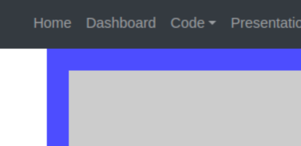
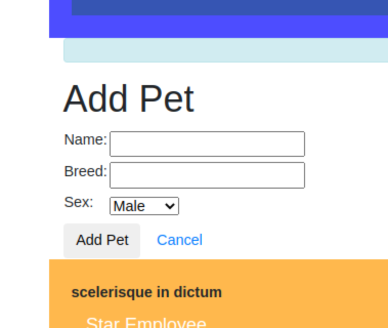
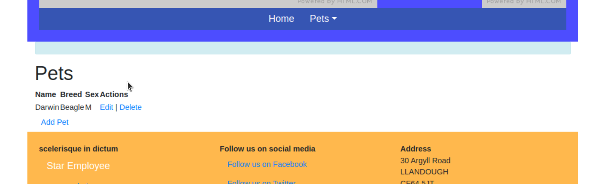
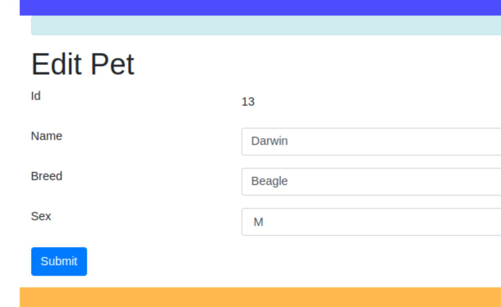
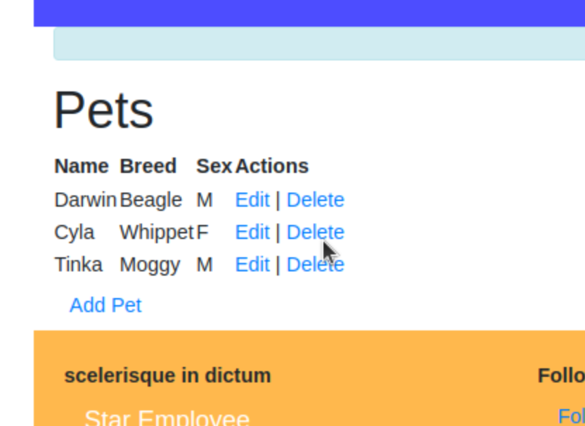

# Coding the ATS Veterinarian Booking System using AI

Ask AI to create a base Web2py application based on your design. You should model this as close as possible to the design. For example, the following requests specify the relationship between each entity (table) and specify the attributes (fields), in two requests.

- *[Introducion](README.md)
- *[Lesson 1. Define the base Web2py application](LESSON_1.md)
- *[Lesson 2. Create the create_pet view](LESSON_2.md)
- *[Lesson 3. Implement Form Validation and Datatypes](LESSON_3.md)
- *[Troubleshooting](TROUBLESHOOTING.md)

**IMPORTANT:**

When using AI it is best practive to keep each request in the same conversation.

# Lesson 2. Create the create_pet view #

From the request, AI did not generate the code for the create_pet.html,

## Implement the code ##

**Create a view pets/create_pet.html**

1. From the site page click dashboard



2. Beneath the views (html) pages, click Create and enter 'pets/create_pet.html'.

3. Click Create below the text

4. Copy-and-paste the following html code.

NOTE: For the purpose of this tutorial we will use {{=form}} which will render it own html.

```html
{{extend 'layout.html'}}

<h1>Add Pet</h1>
{{=form}}
```

**From the Pet index page (http://127.0.0.1:8000/ats_bookings/pets/index), click Add Pet**

1. Go to the site, select Pets > List from the main menu.

2. Select Add Pet

3. Enter the name, breed and select sex.

4. Click Add Pet



5. The implementation has limited or innaccurate functionality. 

6. After the form has submitted, you should see the record appear on the Pets index page (alternatively, select Pets > List from the main menu).



**Create a view pets/edit_pet.html**

1. From the site page click dashboard


2. Beneath the views (html) pages, click Create and enter 'pets/edit_pet.html'.

3. Click Create below the text.

4. Copy-and-paste the following html code.

NOTE: For the purpose of this tutorial we will use {{=form}} which will render it own html.

```html
{{extend 'layout.html'}}

<h1>Edit Pet</h1>
{{=form}}
```

1. Go to the site, select Pets > List from the main menu.

2. Select Edit next one of the pets you've created.



**Test the delete action**

1. Go to the site, select Pets > List from the main menu.

2. Select delete next to the pet you no longer want.

3. Click OK to confirm you want to delete.



**DISCLAIMER**

Writing code requires careful consideration of various factors, such as specific requirements, best practices, and potential risks. Therefore, it is crucial to thoroughly review and test any code generated by this AI model before implementing it in a production environment. The user assumes all responsibility and liability for the usage and consequences of any code written or derived from this AI model. The AI model's responses should be used with caution and verified by human experts to ensure accuracy and suitability for the intended purpose. OpenAI, the developers of this AI model, cannot be held liable for any damages or losses resulting from the use of the generated code.

**This guide uses markdown.**

*[Markdown Guide](https://www.markdownguide.org/basic-syntax/)