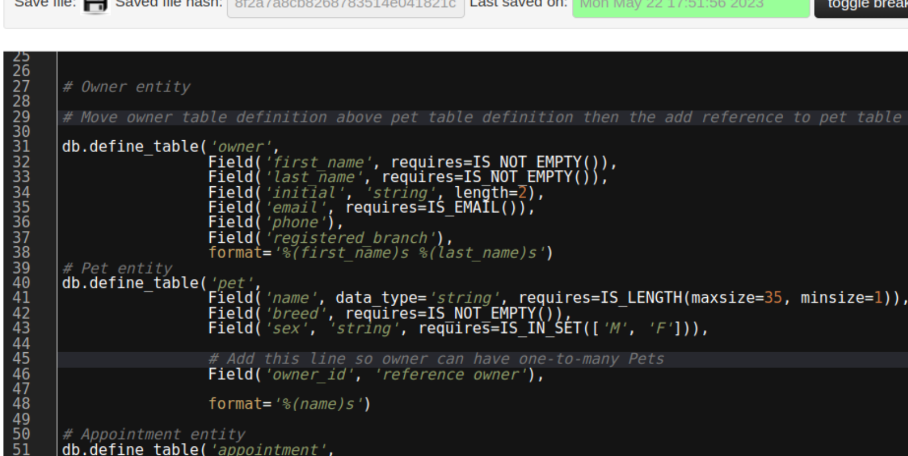
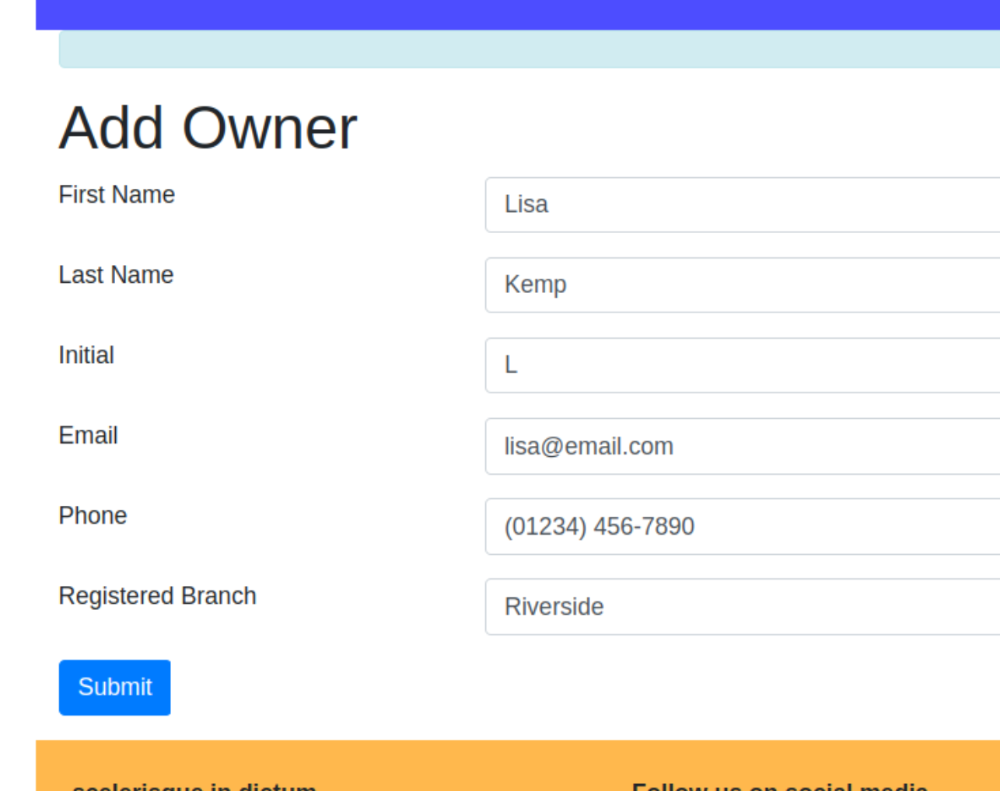
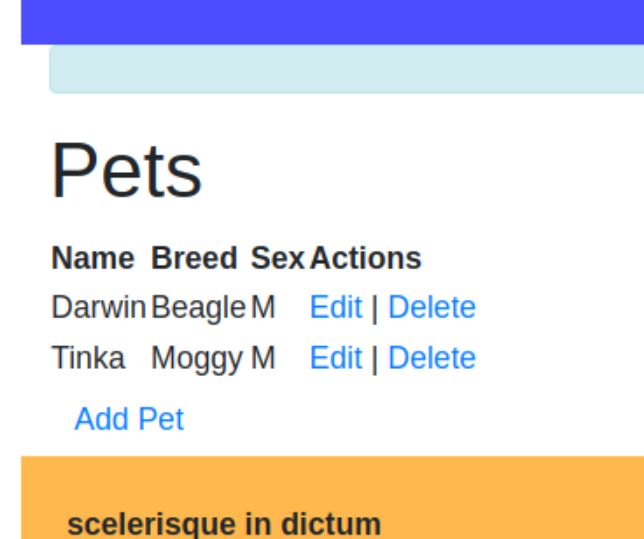
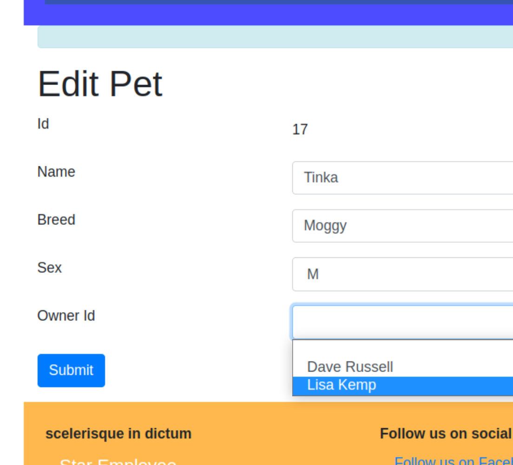
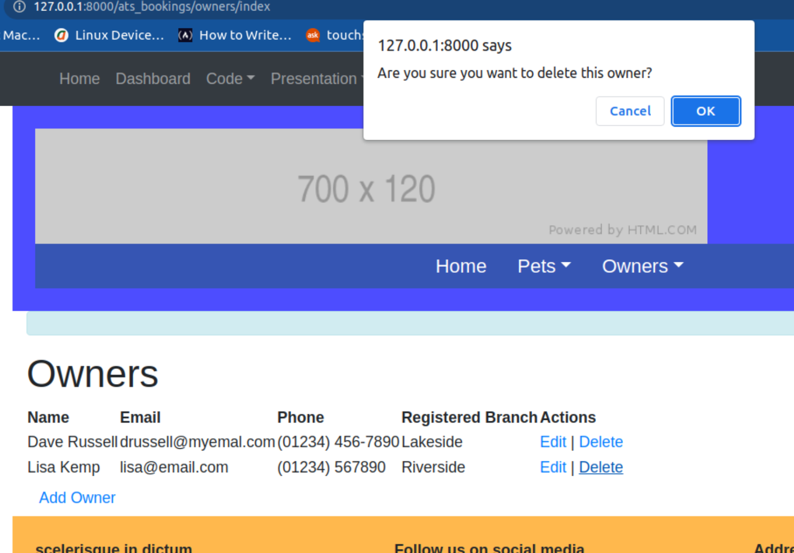

# Coding the ATS Veterinarian Booking System using AI

Ask AI to create a base Web2py application based on your design. You should model this as close as possible to the design. For example, the following requests specify the relationship between each entity (table) and specify the attributes (fields), in two requests.

- *[Introducion](README.md)
- *[Lesson 1. Define the base Web2py application](LESSON_1.md)
- *[Lesson 2. Create the create_pet view](LESSON_2.md)
- *[Lesson 3. Implement Form Validation and Datatypes](LESSON_3.md)
- *[Lesson 4. Create controllers for CRUD actions for each entity](LESSON_4.md)
- *[Lesson 5. Fixing and creating relationships](LESSON_5.md)
- *[Lesson 6. Functional Testing and Boundary Testing](LESSON_6.md)
- *[Troubleshooting](TROUBLESHOOTING.md)

**IMPORTANT:**

When using AI it is best practive to keep each request in the same conversation.

# Lesson 5. Create controllers for CRUD actions for each entity #

At the end of the last lesson (*[Lesson 4. Create controllers for CRUD actions for each](LESSON_4.md)), you should have created all entities and matching controllers with CRUD actions.

Entity Name
- Pet
- Owner
- Appointment
- Treatment
- Vet
- Skill
- Treatment Cost

## 1. Ask AI to create references ##

The Pets table does not have and owner.

<details>
    <summary>Click to view AI request</summary>

owner can have one-to-many pets

</details>

<details>
    <summary>Click to view AI response</summary>

To modify the owner-pet relationship so that an owner can have one to many pets, you need to update the database model and the corresponding views and controllers. Here's an updated version:

models/db.py
'''python
Copy code
from datetime import datetime
from decimal import Decimal

db = DAL('sqlite://storage.sqlite')

# Pet entity
db.define_table('pet',
                Field('name', requires=IS_NOT_EMPTY()),
                Field('breed', requires=IS_NOT_EMPTY()),
                Field('sex', 'string', requires=IS_IN_SET(['M', 'F'])),
                Field('owner_id', 'reference owner'),
                format='%(name)s')

# Owner entity
db.define_table('owner',
                Field('first_name', requires=IS_NOT_EMPTY()),
                Field('last_name', requires=IS_NOT_EMPTY()),
                Field('initial', 'string', length=2),
                Field('email', requires=IS_EMAIL()),
                Field('phone'),
                Field('registered_branch'),
                format='%(first_name)s %(last_name)s')

# Appointment entity
db.define_table('appointment',
                Field('pet_id', 'reference pet'),
                Field('date', 'date', default=datetime.now().date(), requires=IS_DATE()),
                Field('time', 'time', default=datetime.now().time(), requires=IS_TIME()),
                Field('registered_branch'),
                format='%(date)s')

# Treatment entity
db.define_table('treatment',
                Field('appointment_id', 'reference appointment'),
                Field('vet_id', 'reference vet'),
                Field('description', 'text'),
                format='%(description)s')

# Vet entity
db.define_table('vet',
                Field('first_name', requires=IS_NOT_EMPTY()),
                Field('last_name', requires=IS_NOT_EMPTY()),
                Field('grade'),
                Field('branch'),
                Field('extension'),
                format='%(first_name)s %(last_name)s')

# Skill entity
db.define_table('skill',
                Field('vet_id', 'reference vet'),
                Field('name', requires=IS_NOT_EMPTY()),
                format='%(name)s')

# Treatment Cost entity
db.define_table('treatment_cost',
                Field('description', requires=IS_NOT_EMPTY()),
                Field('cost', 'decimal(10,2)', default=Decimal('0.00')),
                format='%(description)s')
```

Now the owner entity has a foreign key owner_id in the pet table, allowing an owner to have multiple pets.

Ensure that you update the corresponding views and controllers to reflect the changes in the database model.
    
</details>

## 2. Implementing the code ##

In the *models/db_custom.py*
- Create the owner table definition before pet.
- Add the attribute to the pet table definition - Field('owner_id', 'reference owner').



models/db_custom.py
```python
...
# Owner entity

# Move owner table definition above pet table definition then the add reference to pet table

db.define_table('owner',
                Field('first_name', requires=IS_NOT_EMPTY()),
                Field('last_name', requires=IS_NOT_EMPTY()),
                Field('initial', 'string', length=2),
                Field('email', requires=IS_EMAIL()),
                Field('phone'),
                Field('registered_branch'),
                format='%(first_name)s %(last_name)s')
# Pet entity
db.define_table('pet',
                Field('name', data_type='string', requires=IS_LENGTH(maxsize=35, minsize=1)),
                Field('breed', requires=IS_NOT_EMPTY()),
                Field('sex', 'string', requires=IS_IN_SET(['M', 'F'])),

                # Add this line so owner can have one-to-many Pets
                Field('owner_id', 'reference owner'),

                format='%(name)s')
...
```

## 3. Testing ##

**Test the pet edit action**

1. Enter Owner details, then click submit.



2. Click menu and select Pet > List.

3. Click edit next the pet.



4. Select Owner from drop down, then click submit



**Test the delete action**

1. From the Owner index page, delete the Owner assigned to the pet.

2. Click OK to confirm you want to delete.



NOTE: *Both the Owner and Pet are deleted*


# NEXT STEPS #

Repeat the steps above to create a controller and view for each entity.

*[Lesson 6. Functional Testing and Boundary Testing ](LESSON_6.md)

**DISCLAIMER**

Writing code requires careful consideration of various factors, such as specific requirements, best practices, and potential risks. Therefore, it is crucial to thoroughly review and test any code generated by this AI model before implementing it in a production environment. The user assumes all responsibility and liability for the usage and consequences of any code written or derived from this AI model. The AI model's responses should be used with caution and verified by human experts to ensure accuracy and suitability for the intended purpose. OpenAI, the developers of this AI model, cannot be held liable for any damages or losses resulting from the use of the generated code.

**This guide uses markdown.**

*[Markdown Guide](https://www.markdownguide.org/basic-syntax/)