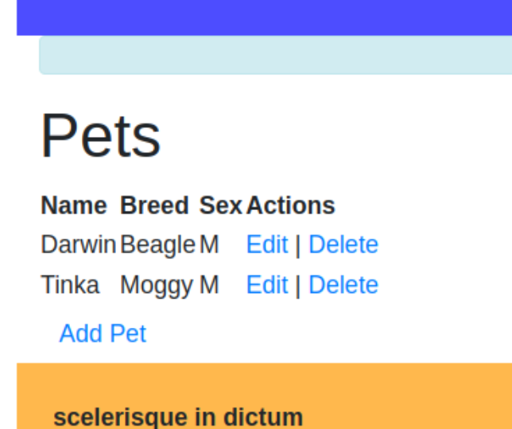

# Coding the ATS Veterinarian Booking System using AI

Ask AI to create a base Web2py application based on your design. You should model this as close as possible to the design. For example, the following requests specify the relationship between each entity (table) and specify the attributes (fields), in two requests.

- *[Introducion](README.md)
- *[Lesson 1. Define the base Web2py application](LESSON_1.md)
- *[Lesson 2. Create the create_pet view](LESSON_2.md)
- *[Lesson 3. Implement Form Validation and Datatypes](LESSON_3.md)
- *[Lesson 4. Create controllers for CRUD actions for each entity](LESSON_4.md)
- *[Lesson 5. Fixing and creating relationships](LESSON_5.md)
- *[Lesson 6. Functional Testing and Boundary Testing](LESSON_6.md)
- *[Troubleshooting](TROUBLESHOOTING.md)

**IMPORTANT:**

When using AI it is best practive to keep each request in the same conversation.

# Lesson 6. Functional Testing and Boundary Testing #

During previous lesson you created added foreign keys to reference other table ([Lesson 6. Fixing and creating relationships](LESSON_5.md)).

During this lesson you will carry out functional testing.

## 1. We will ask AI to another field to the table ##

<details>
    <summary>Click to view AI request</summary>

Add age column to pet table

</details>

<details>
    <summary>Click to view AI response</summary>

To add an "age" column to the "pet" table, you can modify the code as follows:

models/db.py
```python
db.define_table('pet',
                Field('owner_id', 'reference owner'),
                Field('name', requires=IS_NOT_EMPTY()),
                Field('breed', requires=IS_NOT_EMPTY()),
                Field('sex', 'string', requires=IS_IN_SET(['M', 'F'])),
                Field('age', 'integer', requires=IS_INT_IN_RANGE(0, 100)),
                format='%(name)s')
```

In the updated code, a new field named "age" of type integer has been added to the "pet" table. The IS_INT_IN_RANGE(0, 100) constraint ensures that the age is within the range of 0 to 100.

Remember to update the respective views and forms that interact with the "pet" table to include the age field.

</details>

## 2. Implementing the code ##

In the *models/db_custom.py*
- Add the attribute age to the pet table definition with validation to only allow whole number values between 1 and 40 - Field('age', 'integer', requires=IS_INT_IN_RANGE(1, 41))

models/db_custom.py
```python
...
# Pet entity
db.define_table('pet',
                Field('owner_id', 'reference owner'),
                Field('name', requires=IS_NOT_EMPTY()),
                Field('breed', requires=IS_NOT_EMPTY()),
                Field('sex', 'string', requires=IS_IN_SET(['M', 'F'])),
                Field('age', 'integer', requires=IS_INT_IN_RANGE(0, 40)),
                format='%(name)s')
```
...
```

## 4. Functional Testing ##

Functional testing on a database involves verifying the proper functioning of database operations, including input, update, delete, retrieval of records, and performance. You're testing that all the database's functional requirements are met. 

### BDD Use Case ###

| --- |
| Given the owner has a registered pet at an ATS branch 
When the owner calls the branch to book an appointment 
Then the operator should be able to look up the pet by name or owner's name 
And the operator should offer the owner a date and time for an appointment with a veterinarian at the registered branch 
And the appointment should be recorded in the system |
| --- |

Table definition for owner in db_custom.py 
```python
# Owner entity 
db.define_table('owner', 
    Field('first_name', requires=IS_NOT_EMPTY()), 
    Field('last_name', requires=IS_NOT_EMPTY()), 
    Field('initial', 'string'), 
    Field('email', requires=IS_EMAIL()), 
    Field('phone'), 
    Field('registered_branch'), 
    format='%(first_name)s %(last_name)s') 
```

### Functional Tests for the Owner entity ###

| --- | --- | ------  | 
| Field | Data type | Validation | 
| --- | --- | ------  | 
| First Name | String (Varchar) | Required 1 to 35 characters |
| Last Name | String (Varchar) | Required 1 to 35 characters | 
| Initial | String (Char) | Optional, Maximum 2 Characters  | 
| Email | String (Varchar)  | Required, Email Format, Length, Up to 256 characters. | 
| Phone | String (Varchar) | Optional, Telephone format, between 0 and 15 characters | 
| Registered Branch | Selection of Branch List or Table | Required, Limited to selection of valid branches |
| --- | --- | ------  |

During testing you are not only checking valid data, you will need to cater for incorrect data input (user error) and the errors should be handle according to give a user friendly message. The best-practice here is to use boundary testing - . 

### Attributes, data types and validation ###

From the implementation of the above BDD use case the Appointment entity (table) should store the pet (client), registered branch, Time of the appointment, and the vet. 

The form should include the following attributes (fields) 

### Test the pet edit action ###

Edit an existing pet or create a new pet.

1. Click menu and select Pet > List.
2. Click edit next the pet.



3. Select Owner from drop down, then click submit


## 5. Boundary testing ###

*Example*

*Test Case 1*
Verify that the system handles transactions below the lower boundary correctly. |
- **Input:** Attempt to withdraw £9. |
- **Expected Result:** The system should display an error message indicating that the withdrawal amount is below the minimum limit. | 

*Test Case 2*
Verify that the system handles transactions at the lower boundary correctly. 
- **Input:** Attempt to withdraw £10. 
- **Expected Result:** The system should successfully dispense £10. 

*Test Case 3*
Verify that the system handles transactions at the upper boundary correctly. 
- **Input:** Attempt to withdraw £500. 
- **Expected Result:** The system should successfully dispense £500. 

*Test Case 4*
Verify that the system handles transactions above the upper boundary correctly. 
- **Input:** Attempt to withdraw £501. 
- **Expected Result:** The system should display an error message indicating that the withdrawal amount is above the maximum limit.  

**Carry out Boundary Testing on the Create/Edit Pet**

| --- |
|Given the owner is at an ATS branch 
When the owner registers their pet with the operator 
Then the pet's name, breed, age and sex should be recorded in the system 
And the pet should be associated with the owner's account |
| --- |

*Give the following field to test validation using BVA. Enter the result from your tests.*

| --- | ------  | --- | --- | --- | --- |
| Field | Data type and Validation | Min | Max | Below Min | Above Max |
| --- | ------  | --- | --- | --- | --- | 
| Name | String (Varchar) Required 1 to 35 characters  | Enter a single character | Enter 35 characters | Leave Empty | Enter 36 characters | 
| Breed | String (Varchar) | Required 1 to 20 characters | Enter a single character | Enter 20 characters | Leave Empty | Enter 21 characters |
| Sex | String (Char) | Optional, 1 Character M or F | Enter a single character F | Enter a single character M | Leave Empty | Enter "A" | 
| Age | Integer (Int) | Required, Allowed Range between 1 to 40 | Enter the value 1 | Enter the value 40 | Enter the value 0 or leave Empty | Enter the value 41 | 
| Owner | Reference (Foreign Key) Owner Table | Required, Limited to selection of owner's name in owner table | Select first option | Select last option | Leave Empty | 
| --- | ------  | --- | --- | --- | --- | 

### Include validation rules in the table definition ###

To fix use IS_LENGTH for string, IS_IN_SET for allowed values, and IS_INT_IN_RANGE for integer field. 
```python
# Pet entity 
db.define_table('pet', 
    # name field must be between 1 and 35 characters 
    Field('name', 'string', requires=IS_LENGTH(maxsize=35, minsize=1)), 
    # breed field must be between 1 and 40 characters
    Field('breed', 'string', requires=IS_LENGTH(maxsize=20, minsize=1)), 
    # sex field must be a single character M or F 
    Field('sex', 'string', requires=IS_IN_SET(['M', 'F'])), 
    # age field must between between 1 and 40 
    Field('age', 'integer', requires=IS_INT_IN_RANGE(1, 41)), 
    # owner can have one-to-many Pets 
    Field('owner_id', 'reference owner'), format='%(name)s') 
```


**DISCLAIMER**

Writing code requires careful consideration of various factors, such as specific requirements, best practices, and potential risks. Therefore, it is crucial to thoroughly review and test any code generated by this AI model before implementing it in a production environment. The user assumes all responsibility and liability for the usage and consequences of any code written or derived from this AI model. The AI model's responses should be used with caution and verified by human experts to ensure accuracy and suitability for the intended purpose. OpenAI, the developers of this AI model, cannot be held liable for any damages or losses resulting from the use of the generated code.

**This guide uses markdown.**

*[Markdown Guide](https://www.markdownguide.org/basic-syntax/)