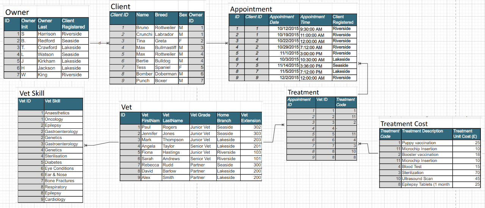

# Demonstration using ChatGPT

Give the following tables and data ask AI to create a base Web2py application.



## Lesson 1. Define the base Web2py application

    
You: Create Web2py MVC application for ATS Veternarian Booking System with pet (client) has one to many owners, pet can have none to many appointments,  an appointment can have zero to many treatments, a vet and prescribe zero to many treatments, a vet can have one to many skills, and a treatment cost can have one to many treatments.

<details>
  <summary>==Click me to show AI Answer==</summary>

Sure! I can provide you with a basic structure for your web application using the web2py framework. Please note that this is a simplified example, and you may need to customize it further based on your specific requirements.

First, let's define the database tables/models in the web2py application. We will have the following tables:

1. Pet: This table represents the pets (clients) in the system. It will have a foreign key to the Owner table.

db_custom.py
```python
db.define_table('pet',
    Field('name', 'string'),
    Field('age', 'integer'),
    Field('breed', 'string'),
    Field('owner', 'reference owner')
)
```

2. Owner: This table represents the owners of the pets. It will have a one-to-many relationship with the Pet table.

db_custom.py
```python
db.define_table('owner',
    Field('name', 'string'),
    Field('email', 'string')
)
```

3. Appointment: This table represents the appointments for pets. It will have a foreign key to the Pet table and a many-to-many relationship with the Treatment table.

db_custom.py
```python
db.define_table('appointment',
    Field('pet', 'reference pet'),
    Field('appointment_date', 'date'),
    Field('treatments', 'list:reference treatment')
)
```

4. Treatment: This table represents the treatments available. It will have a many-to-many relationship with the Appointment table and a foreign key to the Vet table.

db_custom.py
```python
db.define_table('treatment',
    Field('name', 'string'),
    Field('cost', 'float'),
    Field('vet', 'reference vet')
)
```

5. Vet: This table represents the veterinarians. It will have a one-to-many relationship with the Treatment table and a many-to-many relationship with the Skill table.

db_custom.py
```python
db.define_table('vet',
    Field('name', 'string'),
    Field('skills', 'list:reference skill')
)
```

6. Skill: This table represents the skills of veterinarians. It will have a many-to-many relationship with the Vet table.

db_custom.py
```python
db.define_table('skill',
    Field('name', 'string')
)
```

Now that we have defined our database tables, we can create the controllers and views for our web application. For brevity, I'll provide only the basic structure.

1. Create a controller called *default.py*:

NOTE: all functions return dict() which is a empty key value pair (See Python Dictionary https://www.w3schools.com/python/python_dictionaries.asp).

controller/default.py

```python
def index():
    return dict()

def pets():
    # Logic to handle pets
    return dict()

def owners():
    # Logic to handle owners
    return dict()

def appointments():
    # Logic to handle appointments
    return dict()

def treatments():
    # Logic to handle treatments
    return dict()

def vets():
    # Logic to handle vets
    return dict()

def skills():
    # Logic to handle skills
    return dict()
```

2. Create corresponding views for each controller action (e.g., `index.html`, `pets.html`, `owners.html`, etc.) and implement the necessary HTML templates to display the data.

This basic structure should give you a starting point for your ATS Veterinary Booking System. From here, you can build upon this structure and add more functionality and features based on your specific requirements.

Please note that this is just a basic outline, and you may need to further customize and refine the code based on your application's needs.
    
</details>
    
### a. modify table definitions

Reference the ERD attributes and datatypes to modify the table definitions in *db_custom.py* you will need to reorder the creation of the table so that any table that references another is defined first. For example, the 'pet' table references 'owner', so the owner table is defined first.

NOTE: Include fake_migrate_all=True. Remove this once you start to populate the tables with data.


```python
db = DAL('sqlite://storage.sqlite', fake_migrate_all=True)
...
# Owner: This table represents the owners of the pets. It will have a one-to-many relationship with the Pet table.

db.define_table('owner',
    Field('init', 'string'),
    Field('last_name', 'string'),
    Field('branch', 'string')
)

# Pet: This table represents the pets (clients) in the system. It will have a foreign key to the Owner table.

db.define_table('pet',
    Field('name', 'string'),
    Field('breed', 'string'),
    Field('sex', 'string'),
    Field('owner', 'reference owner')
)

# Vet: This table represents the veterinarians. It will have a one-to-many relationship with the Treatment table and a many-to-many relationship with the Skill table.

db.define_table('vet',
    Field('first_name', 'string'),
    Field('last_name', 'string'),
    Field('grade', 'string'),
    Field('branch', 'string'),
    Field('extension', 'integer')
)

#Skill: This table represents the skills of veterinarians. It will have a many-to-many relationship with the Vet table.

db.define_table('skill',
    Field('name', 'string'),
    Field('skill', 'reference vet')
)

# Appointment: This table represents the appointments for pets. It will have a foreign key to the Pet table and a many-to-many relationship with the Treatment table.

db.define_table('appointment',
    Field('pet', 'reference pet'),
    Field('appointment_date', 'date'),
    Field('branch', 'string')
)

# Treatment: This table represents the treatments available. It will have a many-to-many relationship with the Appointment table and a foreign key to the Vet table.

db.define_table('treatment_cost',
    Field('description', 'string'),
    Field('cost', 'float')
)


db.define_table('treatment',
    Field('appointment', 'reference appointment'),
    Field('vet', 'reference vet'),
    Field('cost', 'reference treatment_cost')
)
```

### b. create views

Create views extending *layout.html*


|-/controllers
|+/views
|++/default
|---appointments.html
|---owners.html
|---pets.html
|---skills.html
|---vets.html


views/default/pets.html
```html
{{extend 'layout.html'}}
<h1>Pets</h1>
```

views/default/owners.html
```html
{{extend 'layout.html'}}
<h1>Owners</h1>
```

views/default/appointments.html
```html
{{extend 'layout.html'}}
<h1>Appointments</h1>
```

views/default/vets.html
```html
{{extend 'layout.html'}}
<h1>Vets</h1>
```

views/default/skills.html
```html
{{extend 'layout.html'}}
<h1>Vet Skills</h1>
```
### c. add menu items to layout.html

Add nav-items to include the links to the html pages via the controller action 
(e.g. the appointment action in the default controller will open *default/appointment.html*).

|-/controllers
|+/views
|--layout.html

views/layout.html
```html
...
                </li>
                <!-- Add menu items nav-item -->
                <li class="nav-item">
                    <a class="nav-link text-white lead" href="{{=URL('default', 'appointments')}}">Appointments</a>
                </li>
                <li class="nav-item">
                    <a class="nav-link text-white lead" href="{{=URL('default', 'owners')}}">Owners</a>
                </li>
                <li class="nav-item">
                    <a class="nav-link text-white lead" href="{{=URL('default', 'pets')}}">Pets</a>
                </li>
                <li class="nav-item">
                    <a class="nav-link text-white lead" href="{{=URL('default', 'vets')}}">Vets</a>
                </li>
                <li class="nav-item">
                    <a class="nav-link text-white lead" href="{{=URL('default', 'skills')}}">Home</a>
                </li>
                <!-- END Add menu items nav-item -->
                </ul>
            <!-- END Main Menu -->
        </div>
    </div>
</div>
...
```

## Lesson 2. Register pets

### Using AI

1. Generate the code to register a pet

You: Create Web2py Code for the follow BDD Use Case

Feature: Pet registration 
Scenario: Owner registers a new pet 
Given the owner is at an ATS branch 
When the owner registers their pet with the operator 
Then the pet's name, breed, and sex should be recorded in the system 
And the pet should be associated with the owner's account"

<details>
  <summary>==Click me to show AI Answer==</summary>

Sure! Here's an example implementation of the given BDD use case in web2py:

Create a new controller called *default.py*:
```python
Copy code
def register_pet():
    form = SQLFORM(db.pet)
    if form.process().accepted:
        pet_id = form.vars.id
        owner_id = request.vars.owner_id
        db.pet_owner.insert(pet=pet_id, owner=owner_id)
        response.flash = "Pet registered successfully!"
    return dict(form=form)
    ```
Create a corresponding view called *register_pet.html*:
```html
Copy code
{{extend 'layout.html'}}

<h1>Register Pet</h1>

{{=form}}

<hr>

<a href="{{=URL('default', 'index')}}">Back to Home</a>
```

Modify the index() function in the *default.py* controller to handle the scenario where the owner is at an ATS branch:
```python
Copy code
def index():
    owner_id = request.vars.owner_id
    return dict(owner_id=owner_id)
    ```
Update the *index.html* view to include a link to register a new pet:
```html
Copy code
{{extend 'layout.html'}}

<h1>ATS Branch</h1>

<p>Welcome to the ATS branch!</p>

<p>Owner ID: {{=owner_id}}</p>

<a href="{{=URL('default', 'register_pet', vars={'owner_id': owner_id})}}">Register a New Pet</a>
```

In this implementation, when the owner visits the ATS branch, they will see the home page (index.html) with their owner ID displayed. The owner can then click on the "Register a New Pet" link, which will take them to the register_pet() action. They can fill out the form with the pet's name, breed, and sex, and submit it. Upon successful registration, the pet's information will be recorded in the system, and the pet will be associated with the owner's account.

Please note that this is a simplified implementation to demonstrate the use case. In a real-world application, you would need to handle authentication, validation, error handling, and other aspects to ensure the security and functionality of the system. 

</details>


## Review and modify the AI generated code

Add the register_pet action to the *controllers/default.py* below the pets action.

|-/controllers
|--default.py

```python
Copy code
def index():
    owner_id = request.vars.owner_id
    return dict(owner_id=owner_id)

def register_pet():
    # Logic to create pets
    form = SQLFORM(db.pet)
    if form.process().accepted:
        pet_id = form.vars.id
        owner_id = request.vars.owner_id
        db.pet_owner.insert(pet=pet_id, owner=owner_id)
        response.flash = "Pet registered successfully!"
    return dict(form=form)
```

Create *default/register_pet.html*

|-/controllers
|+/views
|++/default
|---register_pet.html

```html
Copy code
{{extend 'layout.html'}}

<h1>Pets</h1>

{{=form}}

<hr>

<a href="{{=URL('default', 'index')}}">Back to Home</a>
```

To access the new register_let

```html
Copy code
{{extend 'layout.html'}}

<h1>Pets</h1>

{{=form}}

<hr>

<a href="{{=URL('default', 'index')}}">Back to Home</a>
```

2. After successfully registering a pet show the list of pets

"show list of registered pets"

<details>
  <summary>==Click me to show AI Answer==</summary>

To display a list of registered pets, you can modify the index() function in the *default.py* controller to retrieve the list of pets associated with the owner's account. Here's an example:

```python
Copy code
def index():
    owner_id = request.vars.owner_id
    pets = db(db.pet_owner.owner == owner_id).select(db.pet.ALL)
    return dict(owner_id=owner_id, pets=pets)
```

In this code, we retrieve the owner's ID from the request variables and query the pet_owner table to get all the pets associated with that owner. We then pass the owner ID and the list of pets to the view.

Next, update the *index.html* view to display the list of registered pets:

```html 
Copy code
{{extend 'layout.html'}}

<h1>ATS Branch</h1>

<p>Welcome to the ATS branch!</p>

<p>Owner ID: {{=owner_id}}</p>

<h2>Registered Pets:</h2>
<ul>
  {{for pet in pets:}}
  <li>{{=pet.name}} - Breed: {{=pet.breed}} - Sex: {{=pet.sex}}</li>
  {{pass}}
</ul>

<a href="{{=URL('default', 'register_pet', vars={'owner_id': owner_id})}}">Register a New Pet</a>
```

In this code, we loop over the pets list and display each pet's name, breed, and sex in an unordered list.

Now, when the owner visits the ATS branch and goes to the home page (*index.html*), they will see the list of their registered pets, along with the option to register a new pet.

Please note that you may need to customize the code further based on your specific database schema and naming conventions.

</details>

Update *default/index.html*

|-/controllers
|+/views
|++/default
|---index.html

```python
Copy code
def index():
    owner_id = request.vars.owner_id
    pets = db(db.pet_owner.owner == owner_id).select(db.pet.ALL)
    return dict(owner_id=owner_id, pets=pets)
```


Update *default/index.html* to show registered pets for given owner.

|-/controllers
|+/views
|++/default
|---index.html

```html
Copy code 
{{extend 'layout.html'}}

<h1>ATS Branch</h1>

<p>Welcome to the ATS branch!</p>

<p>Owner ID: {{=owner_id}}</p>

<h2>Registered Pets:</h2>
<ul>
  {{for pet in pets:}}
  <li>{{=pet.name}} - Breed: {{=pet.breed}} - Sex: {{=pet.sex}}</li>
  {{pass}}
</ul>

<a href="{{=URL('default', 'register_pet', vars={'owner_id': owner_id})}}">Register a New Pet</a>
```