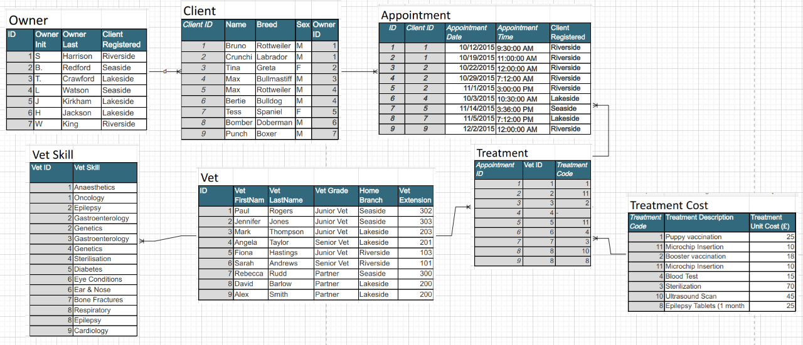

# Demonstration using ChatGPT

Give the following tables and data ask AI to create a base Web2py application.



## Define the base Web2py application

You: Create Web2py MVC application for ATS Veternarian Booking System with pet (client) has one to many owners, pet can have none to many appointments,  an appointment can have zero to many treatments, a vet and prescribe zero to many treatments, a vet can have one to many skills, and a treatment cost can have one to many treatments.

AI: Sure! I can provide you with a basic structure for your web application using the web2py framework. Please note that this is a simplified example, and you may need to customize it further based on your specific requirements.

First, let's define the database tables/models in the web2py application. We will have the following tables:

1. Pet: This table represents the pets (clients) in the system. It will have a foreign key to the Owner table.

db_custom.py
```python
db.define_table('pet',
    Field('name', 'string'),
    Field('age', 'integer'),
    Field('breed', 'string'),
    Field('owner', 'reference owner')
)
```

2. Owner: This table represents the owners of the pets. It will have a one-to-many relationship with the Pet table.

db_custom.py
```python
db.define_table('owner',
    Field('name', 'string'),
    Field('email', 'string')
)
```

3. Appointment: This table represents the appointments for pets. It will have a foreign key to the Pet table and a many-to-many relationship with the Treatment table.

db_custom.py
```python
db.define_table('appointment',
    Field('pet', 'reference pet'),
    Field('appointment_date', 'date'),
    Field('treatments', 'list:reference treatment')
)
```

4. Treatment: This table represents the treatments available. It will have a many-to-many relationship with the Appointment table and a foreign key to the Vet table.

db_custom.py
```python
db.define_table('treatment',
    Field('name', 'string'),
    Field('cost', 'float'),
    Field('vet', 'reference vet')
)
```

5. Vet: This table represents the veterinarians. It will have a one-to-many relationship with the Treatment table and a many-to-many relationship with the Skill table.

db_custom.py
```python
db.define_table('vet',
    Field('name', 'string'),
    Field('skills', 'list:reference skill')
)
```

6. Skill: This table represents the skills of veterinarians. It will have a many-to-many relationship with the Vet table.

db_custom.py
```python
db.define_table('skill',
    Field('name', 'string')
)
```

Now that we have defined our database tables, we can create the controllers and views for our web application. For brevity, I'll provide only the basic structure.

1. Create a controller called `default.py`:

db_custom.py
```python
def index():
    return dict()

def pets():
    # Logic to handle pets

def owners():
    # Logic to handle owners

def appointments():
    # Logic to handle appointments

def treatments():
    # Logic to handle treatments

def vets():
    # Logic to handle vets

def skills():
    # Logic to handle skills
```

2. Create corresponding views for each controller action (e.g., `index.html`, `pets.html`, `owners.html`, etc.) and implement the necessary HTML templates to display the data.

This basic structure should give you a starting point for your ATS Veterinary Booking System. From here, you can build upon this structure and add more functionality and features based on your specific requirements.

Please note that this is just a basic outline, and you may need to further customize and refine the code based on your application's needs.


